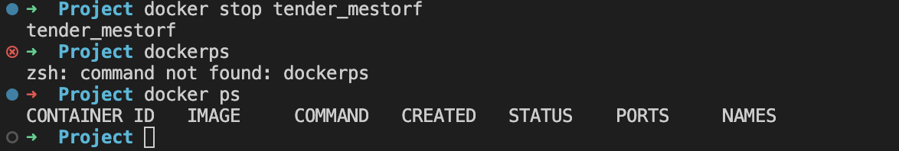
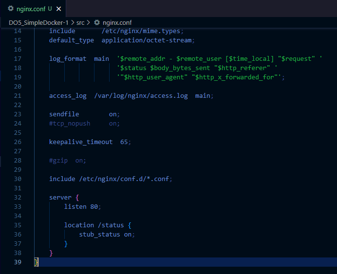
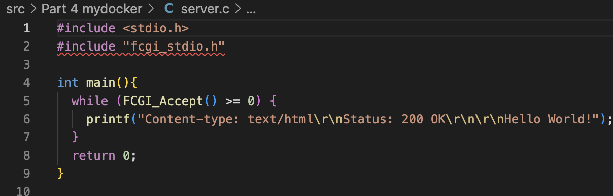
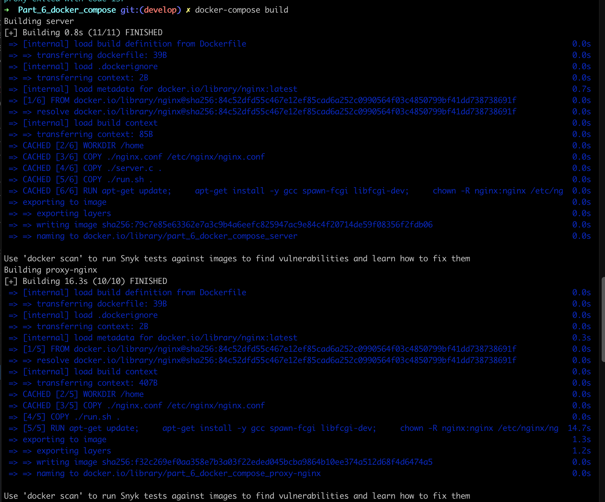

[image-id-1]: img/part1-1.png
[image-id-2]: img/part1-2.png
[image-id-3]: img/part1-3.png
[image-id-4]: img/part1-4.png
[image-id-5]: img/part1-5.png
[image-id-6]: img/part1-6.png
[image-id-7]: img/part1-7.png
[image-id-8]: img/part1-8.png
[image-id-9]: img/part1-9.png
[image-id-10]: img/part2-1.png
[image-id-11]: img/part2-2.png
[image-id-12]: img/part2-3.png
[image-id-13]: img/part2-4.png
[image-id-14]: img/part2-5.png
[image-id-15]: img/part2-6.png
[image-id-16]: img/part2-7.png
[image-id-17]: img/part2-8.png
[image-id-18]: img/part2-9.png
[image-id-19]: img/part2-10.png
[image-id-20]: img/part2-11.png
[image-id-21]: img/part2-12.png
[image-id-22]: img/part2-13.png
[image-id-23]: img/part3-1.png
[image-id-24]: img/part3-2.png
[image-id-25]: img/part3-3.png
[image-id-26]: img/part3-4.png
[image-id-27]: img/part3-5.png
[image-id-28]: img/part4-1.png
[image-id-29]: img/part4-2.png
[image-id-30]: img/part4-3.png
[image-id-31]: img/part4-4.png
[image-id-32]: img/part4-5.png
[image-id-33]: img/part4-6.png
[image-id-34]: img/part5-1.png
[image-id-35]: img/part5-2.png
[image-id-36]: img/part5-3.png
[image-id-37]: img/part5-4.png
[image-id-38]: img/part5-5.png
[image-id-39]: img/part6-1.png
[image-id-40]: img/part6-2.png
[image-id-41]: img/part6-3.png
[image-id-42]: img/part6-4.png
[image-id-43]: img/part6-5.png
[image-id-44]: img/part6-6.png
[image-id-45]: img/part6-7.png

# Report by raffordg
   
## Part 1. Готовый докер

- Возьмем официальный докер-образ с nginx и выкачаем его при помощи `docker pull`
  *скачивание образа nginx*

- Удостоверимся, что докер-образ с nginx существует на нашем пк с помощью команды `docker images`
  *проверка существования образа nginx*

- Запускаем докер-образ через `docker run -d [image_id|repository]`
  *запуск образа nginx*

- Проверяем, запустился ли образ через `docker ps`
  *проверка запуска образа nginx*

- Посмотрим информацию о контейнере с помощью `docker inspect [container_id|container_name]`, узнаем размер контейнера, список замапленных портов и ip:
  *получение информации об образе nginx*

- Остановим докер-образ с помощью `docker stop [container_id|container_name]` и проверим, получилось ли с помощью `docker ps`:
  *остановка образа nginx*

- Запустим докер с портами 80 и 443 в контейнере, замапленными на такие же порты на локальной машине, через команду run.
  *запуск образа nginx с портами 80 и 443*

- Проверим, что в браузере по адресу localhost:80 доступна стартовая страница nginx.
  

- Перезапустим докер контейнер через `docker restart [container_id|container_name]` и проверимб успешно ли выполнилась команда:
  *перезапуск образа nginx*

## Part 2. Операции с контейнером

- Прочитаем конфигурационный файл *nginx.conf* внутри докер контейнера через команду *exec*:
  *получение конфигурационного файла*

- Создадим в локальном репозитории файл *nginx.conf* и настроим в нем по пути */status* отдачу страницы статуса сервера **nginx**.
  *создание конфигурационного файла*

- Скопируем созданный файл *nginx.conf* внутрь докер-образа через команду `docker cp`.

- Перезапустим **nginx** внутри докер-образа через команду *exec*:

- Проверим, что по адресу *localhost:80/status* отдается страничка со статусом сервера **nginx**.

 
- Экспортируем контейнер в файл *container.tar* через команду *export*, затем остановим контейнер:

- Удалим образ через `docker rmi [image_id|repository]`, не удаляя перед этим контейнеры:

- Далее удалим остановленный контейнер командой `docker rm [container_id|container_name]`:

- Импортируем контейнер обратно через команду *import*:

- Запустим импортированный контейнер:

- Проверим, что по адресу *localhost:80/status* отдается страничка со статусом сервера **nginx**.

    Для начала введем команду `docker exec [container id/container name] curl localhost:80/status`:
    
    Затем проверим работу страницы в браузере
    

## Part 3. Мини веб-сервер

- Пишем мини сервер на C и FastCgi, который будет возвращать простейшую страничку с надписью 'Hello World!', c помощью команды ` docker cp server.c [container id/container name]:/home` копируем наш файл в необходимую директорию

- Пишем свой nginx.conf, который будет проксировать все запросы с 81 порта на 127.0.0.1:8080,  c помощью команды `docker cp nginx.conf [container id/container name]:/etc/nginx` копируем наш конфиг в необходимую директорию

- Заходим в контейнер командой `docker exec -it [container id/container name] bash` и в bash, обновляем репозитории, устанавливаем gcc, spawn-fcgi и libfcgi-dev

- Компилируем и запускаем сервер

- Проверяем работу сервера

## Part 4. Свой докер

- Создаём докерфайл

- Создаём скрипт, выполняющий роль entrypoint

- Собираем docker-image, указывая имя и тэг

- Проверяем наличие docker-image

- Запускаем собранный докер образ с маппингом 81 порта на 80 на локальной машине и маппингом папки ./nginx внутрь контейнера по адресу, где лежат конфигурационные файлы nginx'а

- Проверим ответ сервера nginx

## Part 5. **Dockle**

- Устанавливаем Dockle

- Проверяем наш докер-образ с помощью dockle

- Исправляем dockerfile, чтобы убрать все имеющиеся ошибки и предупреждения
  *исправлены ошибки DKL-DI-0005, CIS-DI-0001, CIS-DI-0007, CIS-DI-0006*

    Так как образ создается на основе официальной последней версии nginx, в Dockerfile которой используются NGINX_GPGKEY и NGINX_GPGKEY_PATH, это приводит к ложным срабатываниям предупреждений в Dockle, который в CIS-DI-0010 ищет ключевые слова (key, password). Поэтому запустим dockle с флагом -ak

- Сборка докер-образа и проверка его работоспособности с помощью dockle:

## Part 6. Базовый **Docker Compose**

- Для того, чтобы собрать докер-контейнер на nginx, портирующий запромы с 8080 порта на 81 порт ранее запущенного контейнера необходимо изменить содержания конфигурационных файлов:
  *изменения в файле nginx.conf*

  *изменения в файле dockerfile*

  *изменения в файле run.sh*

*создаем файл docker-compose.yml*

- Соберем проект командой `docker-compose build`

- Запустим проект командой `docker-compose up`

- Проверим отдачу страницы в браузере по адресу `localhost:80`
